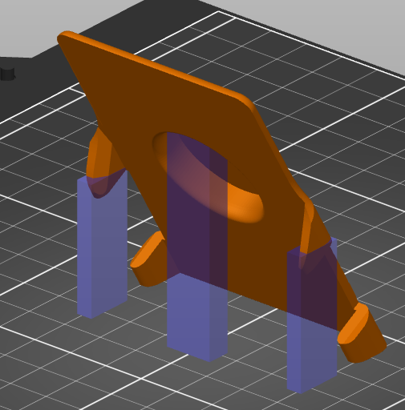
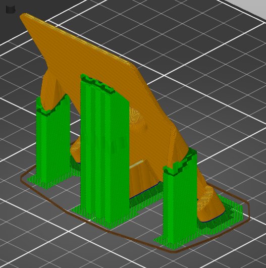
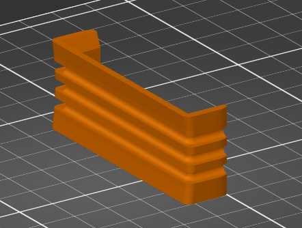
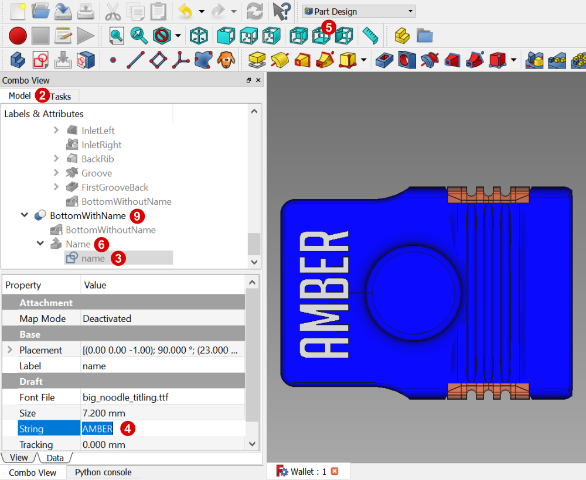

# Travel wallet

This wallet, although very compact, fits:
- 6 to 18 credit cards
- up to 6 euro's in coins and
- some paper money

So if you include the right cards, you can travel the world with not much more than this. If the rubber bands lose their tension, they can easily be replaced wherever you are.

With an alternative top part, fewer credit cards can be stored.

The original CAD file is included, which allows you to personalize it with your name following the [instructions below](#Changing-the-name-in-the-bottom-part).

The models are designed in FreeCAD, a great open source project which has come a long way and deserves much more support from the open source community. 
This whole project including the assembly instructions was created by just using FreeCAD and Inkscape. Hurray for the open source community (and this is my contribution).

The following files are included:

File                   | Contains
---------------------- | ----------------
TravelWallet.FCStd     | Original FreeCAD file with which the models were created
BottomWithoutName.3mf  | A Prusa project file for the bottom part
BottomWithoutName.step | Step file of the bottom part without a name on it
BottomWithoutName.stl  | STL file of the bottom part without a name on it
BottomWithoutName.amf  | AMF file of the bottom part without a name on it
TopPart.3mf            | A Prusa project file for the top part
TopPart.step           | Step file of the top part
TopPart.stl            | STL file of the top part
TopPart.amf            | Advanced manufacturing format of the top part
TopPartSlim.3mf        | A Prusa project file for the top part suitable for fewer credit cards
TopPartSlim.stl        | STL file of the top part suitable for fewer credit cards
TopPartSlim.amf        | Advanced manufacturing format of the top part suitable for fewer credit cards
User Manual.pdf        | The assembly instructions
Readme.md              | This readme file
big_noodle_titling.ttf | The font file used to put a name on the bottom part

## Printing the parts

The print instructions assume the Prusa slicer, but other slicers will also be fine. I used PETG but other materials such as PLA will be no problem.

After printing, the space in the bottom part where the top bar slides through may need a little grinding to form a smooth guide.

### Printing the bottom part

Both parts were designed to have tracks roughly following the U-shape, to get optimal strength. The large bottom part is printed under a 60 degree angle, to make the layers longer and prevent the flat piece from breaking off.

The large bottom part is placed on a raft. Three support enforcers were used:

In the Prusaslicer, choose the following settings:

1. Place the bottom part on it's small end plane under 60° by selecting it and choosing the `Place on face`-button or the shortcut key `F` and select the face that is placed on the build plate.
1. Place the part in the middle by the `Arrange`-button or the shortcut key `A`
1. Choose a layer height of 0.2 mm (others are fine too, depending on the roughness you want and the time you have)
1. Choose 6 perimeter lines in the print settings tab
1. Choose 2 raft layers in the `Support material` section of the `Print settings` tab
1. Add three support enforcers by right-clicking the object in the main window choosing `Add support enforcer`, with positions and dimensions according to the table below. Don't forget to unlock the size lock which allows independent scaling in all directions.
1. Select `For support enforcers only` in the supports drop down list

Support enforcer | Type | Position X | Position Y | Position Z | Size X | Size Y | Size Z | 
---------------- | ---- | -----------| -----------| -----------| -------| -------| -------|
1                | box  | -17 mm     | -30 mm     | 10 mm      | 10 mm  |  4 mm  | 30 mm  |     
2                | box  | -17 mm     |  30 mm     | 10 mm      | 10 mm  |  4 mm  | 30 mm  |     
3                | box  |  -3 mm     |   0 mm     | 9 mm       |  6 mm  | 12 mm  | 50 mm  |     

Printing takes around 3 hours on a Prusa Mk3s

### Printing the top part

The top bar is printed on its side, so the tracks follow the U-shape, to get optimal strength.

In the Prusaslicer, choose the following settings:

1. Place the top part on it's side by selecting it and choosing the `Place on face`-button or the shortcut key `F`
1. Place the part in the middle by the `Arrange`-button or the shortcut key `A`
1. Choose a layer height of 0.2 mm
1. Choose 6 perimeter lines in the print settings tab

Printing takes around 45 minutes on a Prusa Mk3s

## Assembly

What is required:
- 1x bottom part
- 1x top part
- 3x regular rubber bands 60 mm x 1.4 mm 
- 1x plastic L-slieve (to prevent the paper money from sliding)
- 1x small piece of paper (to prevent the coins from making noise)
- Money and cards

## CAD file
The bottom part and the top bar are included in a single FreeCAD file. The is a visual bug in FreeCAD so it may look as if the letters shine through. Don't worry, it does not affect the 3D model.
- If you want to export the top bar, locate `Top part > Top body > Top bar` in the model tree.
- If you want to export the bottom part without a name, locate `Bottom part > Bottom body > BottomWithoutName` in the model tree.
- If you want to export the bottom part with your name on it, follow the [instructions below](#Changing-the-name-in-the-bottom-part).

### Changing the name in the bottom part

This is a little complex and not super straightforward, so follow the instructions carefully.

1. Open `Wallet.FCStd` in [FreeCAD](https://www.freecadweb.org/downloads.php). Version 0.18.4 of FreeCAD was used to create the model.
1. Select the `Model` tab in the `Combo view` 
1. Locate the lowercase `name` entity all the way at the bottom of the model tree. You may need to expand the `BottomPart` and `BottomPartWithName` items if they are collapsed by clicking on the `>`
1. The `name` entity is a `ShapeString` object which contains the text. Find the `string` property and replace the contents with your name. Note that nothing changes yet in the 3D model.
1. Switch to the bottom view by clicking the `bottom view` button or using shortcut key `5`.
1. Right-click the `Name` entity in the model tree just above the `name` entity and choose `Translate`
1. Use the green arrow to move the `Name` entity a little up or down and choose `OK`
1. The text is now redrawn and contains your name. Use `Translate` again until it is perfectly in the middle of the bottom part.
1. Select the `BottomWithName` entity two items above the `Name`entity because this is the item you need to export.
1. Select `File > Export...` from the menu to export the bottom part to a 3D printable file format.

