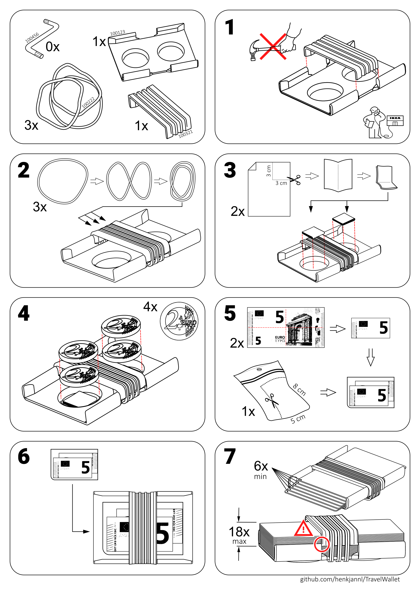
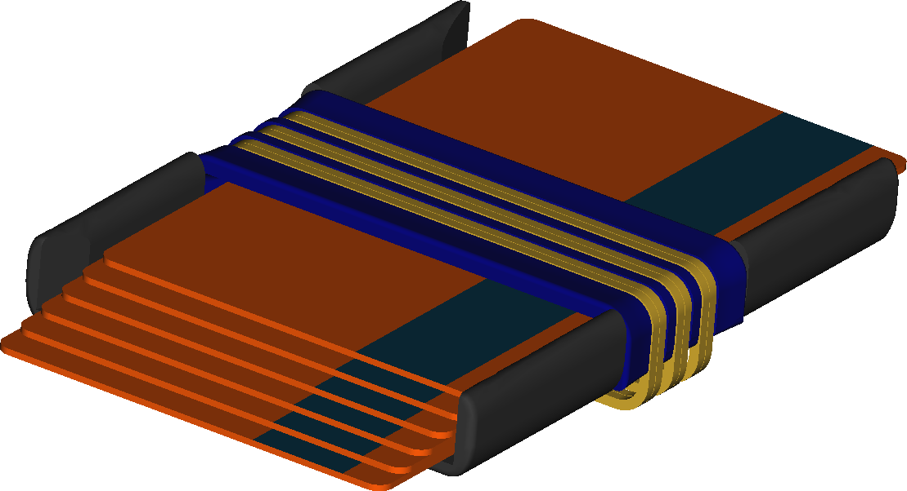

# Travel wallet

This wallet, although very compact, fits:
- 6 to 18 credit cards
- up to 8 euro's in coins and
- some paper money

So if you include the right cards, you can travel the world with not much more than this. If the rubber bands lose their tension, they can easily be replaced wherever you are.

  

The models are designed in FreeCAD, a great open source project which has come a long way and deserves much more support from the open source community. 
This project including the assembly instructions was created by just using FreeCAD and Inkscape. Hurray for the open source community (and this is my contribution).

I documented the workflow of creating the IKEA style assembly instructions (bottom of this document) [HERE](making_of/Readme.md) since this can also be useful for more serious purposes (for folks who want to design a cupboard).

The following files are included:

File                   | Contains
---------------------- | ----------------
Wallet.3mf             | Prusa project file for printing both parts, which includes the 3D models
BottomPart.stl         | Exported 3D model of the bottom part
TopPart.stl            | Exported 3D model of the top part
User Manual.pdf        | The assembly instructions
Noway_Bold.otf         | Font used for the text
BottomPart.FCStd       | FreeCAD file of the bottom part
TopPart.FCStd          | FreeCAD file of the top part
TravelWallet.FCStd     | FreeCAD assembly of the travel wallet
Readme.md              | This readme file
\manual                | Files used to create the images in the user manual
\making_of             | Description of how the assembly instructions were created
\images                | Images used in this readme file

## Adding a name to the bottom part
The model of the bottom part has the following structure:
- Top level contains the bottom part with a name
- The next level contain the text and the bottom part without the text.
By default, the bottom part without the text is made visible.

To add text to the bottom part:
- Make `Bottom part with text` visible by selecting it in the model tree and pressing the space bar
- Make `Bottom part` invisible
- Unfold all subitems of `Slimmed text`
- Change the `String` property of the `Name` item to the correct name
- Right click  `Bottom part with text` and select `Recompute object`
- Change the `Size` of `Name` if the text is too long or too short and recompute
- Move the `Text` item if the text is no longer centered using right-click and `Transform`
  - Modify only the red (X) and the green (Y) arrow, not the blue (Z) one
  - The model is not updated while moving, so choose OK to see the result and repeat if needed
  - It may be useful to reduce the `Translation Increment` 

  

## Printing the parts

The print instructions assume the Prusa slicer, but other slicers will also be fine. I used PETG but other materials such as PLA will be no problem. I printed both parts upright so the U-shapes come out strong.

  

After printing, the space in the bottom part where the top bar slides through may need a little grinding to ensure a smooth guide.

## Assembly instructions

What is required:
- 1x bottom part
- 1x top part
- 3x regular rubber bands 60 mm x 1.4 mm 
- 1x plastic L-slieve (to prevent the paper money from sliding)
- 1x small piece of paper (to prevent the coins from making noise)
- Money and cards

  

## CAD file
The bottom part and the top part were included as separate FreeCAD files, along with an assembly file named TravelWallet.FCStd. 

  

