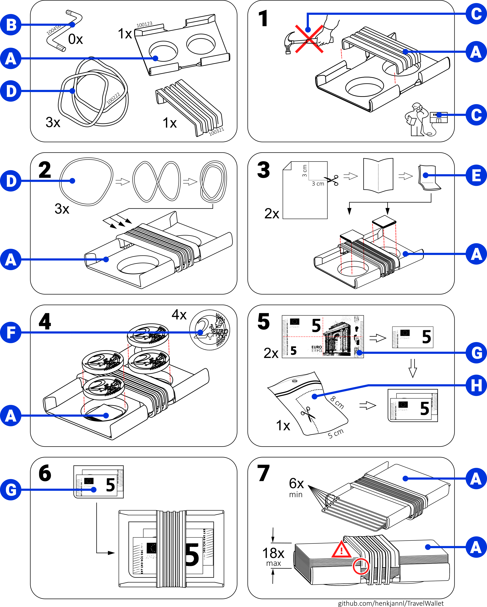
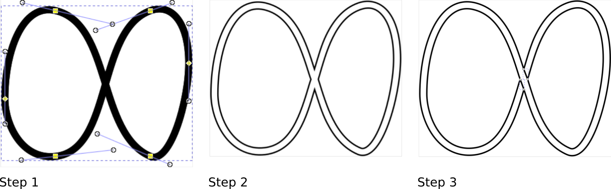

# How the assembly instructions were created

I thought it would be a cool idea to make IKEA style assembly instructions. Creating the assembly instructions actually took more time than building the 3D model.

I documented the workflow since this can be useful for more serious purposes.

All files used to compile the manual are in a separate directory named `manual`. The assembly instructions are in one Inkscape file named `_User Manual.svg`. All images are vector based which translates well to pdf. The pdf file `User Manual.pdf` was created by simply saving this Inkscape file as pdf.

  

This is intended as a tribute to the clear assembly instructions from Sweden. I have absolutely no intent to harm any businedd interests. I'm happy to take the content mentioned under C offline if our friends in Sweden have mixed feelings, just let me know.

## A. The images of the wallet
The workflow for each little 3D image of the model started in FreeCAD:
* For each image of the wallet, create a dedicated FreeCAD assembly of the depicted situation (8 in total). These assemblies were created using the `A2plus` workbench. Each assembly is saved as `/manual/UserManualImage*.FCStd`
* After creating the assembly, group all parts together using the `Compound` command in the `Part` workbench
* Rotate the `Compound` to give it the right orientation when looking from the top by right-clicking `Transform` in the model tree
* Insert a blank A4 page using `Insert Page using Template` in the `TechDraw` workbench
* Insert a view of the model by selecting the `Compound` in the model tree and clicking `Insert View` from the toolbar
* Set the `Smooth Visible` property of the view to `false`
* Exported the drawing to an SVG file using `Page as SVG` (these files can be found under `/manual/UserManualImage*.svg`)

The workflow continues in Inkscape:
* Import each image in the main `_User Manual.svg` file, outside the margin of the main image
* If needed:
  * Ungroup the image completely by using `Object > Ungroup` (or `ctrl-shift-G`) three times
  * Remove superfluous lines manually
  * Grouped the result using `Object > Group` (or `ctrl-G`)
* Apply the default linestyle to the group using `Copy` (`ctrl-C`) on an existing group, and `Paste Style` (`ctrl-shift-V`) selecting the new group
* Drag and scale to the final location. Ensure all scaling options  (right hand side of the toolbar) are switched off to prevent scaling of the the line thickness while adjusting the size of the image. The little lock  needs to be activated to ensure proportional scaling.

## B. The allen key
I googled an image of a typical allen key and manually traced it in Inkscape to create a simple vector image.

## C. The hammer and the 'call IKEA' icon
* Download the "Ikea Billy assembly instructions" as pdf file
* Open the file in Inkscape using `File > Open` and selecting page 10 and 5 respectively
* Copy the resective content to the main Inkscape file

## D. The rubber bands
The rubber bands can be drawn as follows:

1. Draw a closed spline with stroke width of 0.75 mm
1. Choose `Path > Stroke to path`. Change stoke width to 0.15 mm
1. Draw the missing lines using the same linestyle. Group all items together using `Object > Group` (`ctrl-G`)

  

  

## E. The folded paper
The folded paper was simply drawn in Inkscape.

## F. The two euro coins
The two euro coin was downloaded as STEP file and imported into the model.

## G. The five euro bills
The five euro bill was downloaded as bitmap and converted to a vector image using the Inkscape command `Path > Trace bitmap...`

## H. The little plastic bag
The plastic bag was also drawn in Inkscape.
